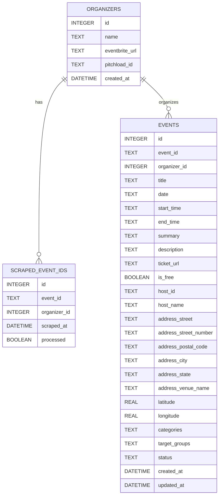

# Eventbrite Scraper

## Introduction

The **Eventbrite Scraper Pipeline** is a university project designed to automate the process of collecting, enriching, and exporting event data. The pipeline integrates multiple technologies and APIs to scrape event data from Eventbrite, enrich it using the Eventbrite API and OpenAI's LLM, and export the processed data to **Pitchload**, a startup database. Additionally, the project aggregates and summarizes startup news from Baden-Württemberg using a news API and OpenAI's LLM. The processed events and news are presented via a custom **frontend** built with Svelte, HTML, and JavaScript.

This project demonstrates the integration of web scraping, API consumption, machine learning, and frontend development in a cohesive pipeline.

---

## Table of Contents

1. [How to Install & Run](#how-to-install--run)
2. [Components Used and Versions](#components-used-and-versions)
3. [Architecture](#architecture)
   - [Project Structure](#project-structure)
   - [Data Flow](#data-flow)
4. [Description of Functions](#description-of-functions)
   - [Backend Scripts](#backend-scripts)
   - [Frontend Components](#frontend-components)
   - [Database Schema](#database-schema)
5. [APIs Used](#apis-used)
6. [Next Steps](#next-steps)
7. [Contributors and Project Details](#contributors-and-project-details)

---

## How to Install & Run

### Prerequisites

Ensure the following are installed on your system:
- **Python 3.9+**
- **Node.js** (for frontend development)
- **SQLite** (for database management)
- **pip** (Python package manager)

### Installation Steps

1. **Unzip the Project Folder**
   - Extract the provided compressed folder to your desired location.

2. **Set Up the Backend**
   - Navigate to the `backend` directory:
     ```bash
     cd backend
     ```
   - *(Optional)* Set up a Python virtual environment:
     ```bash
     python -m venv venv
     source venv/bin/activate  # On Windows: venv\Scripts\activate
     ```
   - Install Python dependencies:
     ```bash
     pip install -r ../requirements.txt
     ```
   - Create the SQLite database:
     ```bash
     python scripts/database.py
     ```
   - **Set Up the `.env` File**:
     - Obtain the following API keys:
       - Eventbrite API Key
       - Pitchload API Key
       - OpenAI API Key
     - Create a `.env` file in the `backend` directory and add the keys in the following format:
       ```env
       EVENTBRITE_API_KEY=your_eventbrite_api_key
       PITCHLOAD_API_KEY=your_pitchload_api_key
       OPENAI_API_KEY=your_openai_api_key
       NEWS_API_KEY=your_news_api_key
       ```

3. **Run the Backend**
   - Start the Flask or FastAPI server:
     ```bash
     python app.py
     ```

4. **Set Up the Frontend**
   - Navigate to the sveltefrontend directory:
     ```bash
     cd ../sveltefrontend
     ```
   - Install dependencies (if using a Svelte-based setup):
     ```bash
     npm install
     ```
   - Run the frontend development server:
     ```bash
     npm run dev
     ```

5. **Access the Application**
   - Open your browser and navigate to:
     - Backend API: `http://localhost:5000`
     - Frontend: `http://localhost:3000`

---

## Components Used and Versions

### Programming Languages and Frameworks

| Component       | Technology/Framework | Version       |
|------------------|-----------------------|---------------|
| **Backend**      | Python               | 3.9+          |
|                  | Flask                | 3.1.0         |
|                  | FastAPI              | 0.115.11      |
| **Frontend**     | Svelte               | Latest        |
|                  | HTML/CSS/JavaScript  | N/A           |
| **Database**     | SQLite               | 3.x           |

### Major Libraries and Tools

| Library/Tool         | Version       | Purpose                                   |
|-----------------------|---------------|-------------------------------------------|
| requests             | 2.32.3       | API requests to Eventbrite and Pitchload |
| python-dotenv        | 1.0.1        | Environment variable management           |
| openai               | 1.1.7        | Integration with OpenAI's GPT models      |
| sqlite3              | Built-in     | Database management                       |
| selenium             | 4.29.0      | Web scraping                              |
| Flask-CORS           | 5.0.1        | Cross-Origin Resource Sharing             |
| OpenStreetMaps API   | N/A          | Displaying events on a map               |

---

## Architecture

### Project Structure

```plaintext
├── backend
│   ├── app.py                     # Main backend application (Flask/FastAPI)
│   ├── eventbrite_fetch.py        # Fetches event data from Eventbrite API
│   ├── eventbrite_scraper.db      # SQLite database
│   ├── fill_missing_values.py     # Enriches data using OpenAI LLM
│   ├── push_events_to_pitchload.py # Pushes processed events to Pitchload
├── frontend
│   ├── home                       # Homepage lists events and news
│   ├── news                       # News page for startup news
│   ├── map                        # Map view page for startup events
│   ├── list                       # Lists all StartUp Events
├── scripts
│       └── database.py            # Creates and manages database schema
├── requirements.txt               # Python dependencies
```

### Data Flow

#### Eventbrite Scraping
- `eventbrite_fetch.py` scrapes event IDs from Eventbrite and stores them in the database.
- The Eventbrite API is used to fetch detailed event data.

#### Data Enrichment
- `fill_missing_values.py` uses OpenAI's GPT to generate missing `target_groups` and `categories`.

#### Export to Pitchload
- `push_events_to_pitchload.py` sends processed events to the Pitchload API.

#### Startup News Aggregation
- A news API fetches startup-related news, which is summarized using OpenAI's GPT.

#### Frontend Presentation
- Events and news are displayed in the custom frontend.
- The OpenStreetMaps API is used to display event locations on an interactive map.

---

## Description of Functions

### Backend Scripts

#### `eventbrite_fetch.py`
- **Purpose**: Fetches event data from Eventbrite and stores it in the database.
- **Key Functions**:
  - `get_unprocessed_event_ids()`: Retrieves unprocessed event IDs.
  - `fetch_event_data()`: Fetches event details from the Eventbrite API.
  - `insert_event_data()`: Inserts event data into the database.

#### `fill_missing_values.py`
- **Purpose**: Enriches event data using OpenAI's GPT to generate missing `target_groups` and `categories`.
- **Key Functions**:
  - `generate_missing_values()`: Uses GPT to generate missing fields.
  - `update_row_in_database()`: Updates the database with generated values.

#### `push_events_to_pitchload.py`
- **Purpose**: Pushes processed events to the Pitchload API.
- **Key Functions**:
  - `push_event_to_pitchload()`: Sends event data to Pitchload.
  - `update_event_host_id()`: Updates the database after a successful push.

### Frontend Components
- **`home.html`**: Display events on the homepage.
- **`news.html`**: Display summarized startup news.
- **`map.html`**: Display startup events in Mapview.

---

## Database Schema

### Tables

1. **`organizers`**
   - Stores organizer details, including `pitchload_id`.

2. **`scraped_event_ids`**
   - Tracks scraped event IDs and their processing status.

3. **`events`**
   - Stores detailed event data, including enriched fields like `categories` and `target_groups`.

#### Database Schema Diagram



---

## APIs Used

### Eventbrite API
- **Purpose**: Fetches event details such as title, date, location, and description.
- **Usage**: Used in `eventbrite_fetch.py` to retrieve event data.

### OpenAI API
- **Purpose**: Enriches event data by generating missing fields like `categories` and `target_groups`. Also used for summarizing startup news.
- **Usage**: Used in `fill_missing_values.py` and the news aggregation pipeline.

### Pitchload API
- **Purpose**: Exports processed event data to the Pitchload startup database.
- **Usage**: Used in `push_events_to_pitchload.py` to send enriched event data.

### News API
- **Purpose**: Aggregates startup-related news from Baden-Württemberg.
- **Usage**: Used in the news aggregation pipeline to fetch relevant articles.

### OpenStreetMaps API
- **Purpose**: Displays event locations on an interactive map.
- **Usage**: Integrated into the frontend to provide a visual representation of event locations.

---

## Next Steps

### Database Normalization
To improve the structure and efficiency of the database, we plan to fully normalize the schema. This will involve restructuring the database to reduce redundancy and ensure that data is stored in a more organized and efficient manner. By normalizing the database, we aim to enhance data integrity and simplify future queries.

### API-First Approach
Moving forward, we propose to adopt an **API-first approach** for data retrieval. Instead of storing event data locally in the database, we will fetch data directly from the Eventbrite API whenever needed. This ensures that the data displayed in the application is always up-to-date and reflects the latest changes from the source.

### Luma Scraper Development
As the next major feature, we will develop a scraper for **Luma**, another event management platform. This will expand the scope of the project by integrating events from multiple platforms, providing a more comprehensive dataset for users.

By implementing these steps, we aim to enhance the functionality, scalability, and reliability of the Eventbrite Scraper Pipeline.

---

## Contributors and Project Details

### Contributors
- **Damian Ziemann**
- **Jana Bröckel**
- **Jana Schäfer**

### Project Information
- **Module**: Entwicklung Verteilter Systeme  
- **Lecturer**: Perrot Cedric  
- **University**: DHBW Stuttgart
